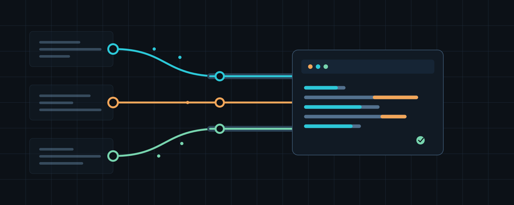

# Multi-CLI Orchestrator



Claude Code plugin for explicitly coordinating `codex` and `agy`.

## Included

- **Orchestration skill:** Claude plans and integrates; `codex` handles
  implementation and tests; `agy` handles images, icons, vectors, and visual
  exploration. The skill activates only when the user explicitly requests
  multi-agent orchestration or names `codex`/`agy`.
- **Prompt-localizer hook:** For eligible non-English prompts, adds an English
  translation and up to four project-grounded notes as context. The original
  prompt is never changed.

## Requirements

- `codex` and `agy` installed, authenticated, and available on `PATH` for
  orchestration.
- Node.js and the `claude` CLI on `PATH` for prompt localization.

The hook makes one additional Claude request for an eligible prompt and sends
that prompt plus lightweight project signals (`package.json` dependencies,
`tsconfig.json` presence, and limited `auth` filename matches). It runs without
tools or session persistence and fails open if unavailable. Install it only
where this cost and data flow are acceptable.

## Install

From a Claude Code session:

```text
/plugin marketplace add quannadev/multi-cli-orchestrator
/plugin install multi-cli-orchestrator@quan-plugins
/reload-plugins
```

## Install In Codex

This repository's marketplace manifest and `UserPromptSubmit` hook are for
Claude Code. Codex can use the orchestration skill, but not that hook.

Install the skill into Codex's skill directory:

```bash
git clone https://github.com/quannadev/multi-cli-orchestrator.git
mkdir -p "${CODEX_HOME:-$HOME/.codex}/skills"
cp -R multi-cli-orchestrator/plugins/multi-cli-orchestrator/skills/multi-cli-orchestrator \
  "${CODEX_HOME:-$HOME/.codex}/skills/"
```

Start a new Codex task after installation. Invoke it as
`$multi-cli-orchestrator`, or let Codex select it when the request explicitly
asks to coordinate `codex` and `agy`.

## Verify

From the repository root:

```bash
claude plugin validate .
node --check plugins/multi-cli-orchestrator/scripts/prompt-rewriter.js
```
